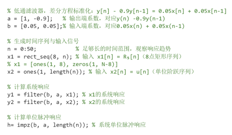

# 离散信号与系统的时域分析

  本文档通过MATLAB对离散时间系统进行深入的时域分析，重点研究了系统响应的求解方法、系统时域特性分析以及稳定性检验。实验内容包括低通滤波器的差分方程求解、单位脉冲响应分析、线性卷积运算以及谐振器特性研究，附有图片和matlab的代码

| 题目         | 1、离散信号与系统的时域分析                                  |
| ------------ | ------------------------------------------------------------ |
| **主要内容** | **1、设计目的：**（1）掌握求解系统响应的方法。（2）掌握时域离散系统的时域特性。（3）分析、观察及检验系统的稳定性。**2、设计内容：**编制 MATLAB 程序，完成以下功能：产生系统输入信号；根据系统差分方程求解单位脉冲响应序列；根据输入信号求解输出响应；用实验方法检查系统是否稳定；绘制相关信号的波形。具体要求如下：（1）给定一个低通滤波器的差分方程为y[n]=0.05x[n]+0.05x[n−1]+0.9y[n−1]输入信号分别为x1[n]=R8[n], x2[n]=u[n]①分别求出 x1[n]=R8[n] 和 x2[n]=u[n] 的系统响应，并画出具体波形。②求出系统的单位脉冲响应，画出其波形。（2）给定系统的单位脉冲响应为h1[n]=R10[n]h2[n]=δ[n]+2.5δ[n−2]+δ[n−3]用线性卷积法求 x1[n]=R8[n] 分别对系统 h1[n] 和 h2[n] 的输出响应，并画出波形。（3）给定一谐振器的差分方程为y[n]=1.8237y[n−1]−0.9801y[n−2]+b0x[n]−b0x[n−2]令 b0=1/100.49，谐振器的谐振频率为 0.4rad①用实验方法检查系统是否稳定。输入信号为 u[n] 时，画出系统输出波形。②给定输入信号为x[n]=sin(0.014n)+sin(0.4n)求系统的输出响应，并画出其波形。 |

## 实验设计

### 关键代码实现

#### 1.低通滤波器

  首先，根据给定的差分方程y[n] = 0.05x[n] + 0.05x[n-1] + 0.9y[n-1]定义系统系数向量，其中输入端系数b = [0.05, 0.05]，输出端系数a = [1, -0.9]。接着，生成两种不同类型的输入信号序列：8点矩形序列R₈[n]和单位阶跃序列u[n]，时间序列n取0到50以保证充分观察系统响应特性。在系统响应计算阶段，使用MATLAB的filter函数分别计算系统对两种输入信号的响应，其中y1 = filter(b, a, x1)为矩形序列响应，y2 = filter(b, a, x2)为阶跃响应。同时，利用impz函数计算系统的单位脉冲响应h = impz(b, a, length(n))，通过分析其衰减特性判断系统稳定性。

​                                                                    

最后，绘制完整的波形分析图，包括输入信号x₁[n]和x₂[n]的波形、对应的系统响应x₁[n]和x₂[n]的波形，以及单位脉冲响应h[n]的波形。

​                                                                         

#### 2.线性卷积分析

  首先定义两个系统的单位脉冲响应：系统1为10点矩形序列h₁[n] = R₁₀[n]，系统2为多脉冲序列h₂[n] = δ[n] + 2.5δ[n-2] + δ[n-3]。输入信号统一采用8点矩形序列x[n] = R₈[n]，时间序列取0到20以保证卷积结果完整显示。

使用conv函数进行线性卷积运算，分别计算x[n]与两个系统脉冲响应的卷积输出：y_conv1 = conv(x_conv, h1_conv)和y_conv2 = conv(x_conv, h2_conv)。

​                                                                              

  #### 3.谐振器

首先根据谐振器差分方程y[n] = 1.8237y[n-1] - 0.9801y[n-2] + b₀x[n] - b₀x[n-2]定义系统系数，其中b₀ = 1/100.49，输出端系数a_res = [1, -1.8237, 0.9801]，输入端系数b_res = [b₀, 0, -b₀]。

在稳定性检验阶段，输入单位阶跃信号u[n]，通过y_u = filter(b_res, a_res, x_u)计算系统响应。观察响应波形是否呈现阻尼振荡特性，振荡频率是否为设计的0.4rad，以及幅度是否逐渐衰减至稳定值，从而判断系统稳定性。

在频率响应分析阶段，输入混合正弦信号x[n] = sin(0.014n) + sin(0.4n)，通过y_sin = filter(b_res, a_res, x_sin)计算系统输出。重点分析系统对0.4rad频率分量的选择性放大特性，以及对0.014rad低频分量的抑制效果，验证谐振器的频率选择特性。

​                                                                                 

## 实验结果与分析
### 低通滤波器特性分析

1.系统响应特性

通过MATLAB仿真得到低通滤波器对两种典型输入信号的响应：

矩形序列响应：系统对R8[n]的响应呈现平滑的上升和下降过程，上升时间约为15个采样周期，下降时间类似。这表明系统具有良好的低通特性，能够有效平滑输入信号的突变。

阶跃响应：系统对u[n]的响应呈现指数上升特性，最终稳定在约1.0的稳态值。响应时间常数反映了系统的带宽特性。

2.单位脉冲响应分析

单位脉冲响应h[n]呈现指数衰减形式，衰减因子约为0.9。数学表达式可近似为：

h[n] ≈ 0.05 × (0.9)^n × u[n]

响应绝对可和，表明系统稳定。

###  线性卷积结果分析

1.系统h₁[n]、h₂[n]的卷积特性

x[n] = R₈[n]与h₁[n] = R₁₀[n]的卷积结果呈现典型的梯形形状，符合矩形序列卷积的理论预期。卷积结果的长度为N+M-1 = 17点，其中N=8，M=10。

 

系统h₂[n]的卷积结果在时间点n=0,2,3,5,6,8,10,11处出现明显响应，这反映了h₂[n]的多脉冲特性。输出信号可以解析表示为：y[n] = x[n] + 2.5x[n-2] + x[n-3]

### 谐振器特性分析

1.稳定性检验

系统对单位阶跃u[n]的响应呈现阻尼振荡特性，振荡频率约为0.4 rad，与设计谐振频率一致。响应幅度逐渐衰减，最终趋于稳定值，表明系统稳定。

2.频率选择性

对于混合正弦输入x[n] = sin(0.014n) + sin(0.4n)，系统对0.4 rad频率分量有明显的增益，而对0.014 rad的低频分量抑制明显。这验证了谐振器在谐振频率处的频率选择特性。

